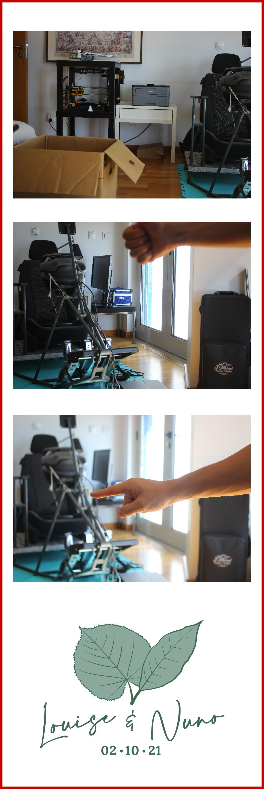

# Photobooth DIY

*Visit the original repo where this was forked from: [sabat54's repos](https://github.com/sabat54i/photoboothdiy)*

This was a cool DIY project, that allowed my to save a few bucks and have a lot of fun in the process.

___
### **Material and cost:**
My old raspberry pi was not in a good shape so I bought a **new RPI-4**, and I also bought a **used Mitsubishi CP-M1 photoprinter**. I used a SLR camera **Canon EOS450** and a **HP 22es monitor**, which I already had. I built the whole structure in wood which was great fun. 

**Overall the project cost around 500€**, including two rolls of photos that allow me to print almost 1500 photos. A professional service that rents photobooths would have cost around the same price, but this way I also got to keep the printer and the raspberry pi. We also ended up using the leftover photoroll to print more pictures to all the guests and send them via mail :)

___
I adapted the original repo for my wedding. It's in many ways similar to the original but since I was changing the printer model and the way the photos and layout were going to look like, I had to add a few features, like debug mode and dynamic shaping of photos to the size of paper. Here's a sample of a final test picture I took before the wedding to make sure all was okay: 

___

For more info head to the [instructables page](https://www.instructables.com/Wedding-Event-Photobooth/), where there is a great example on how to set everything up.
